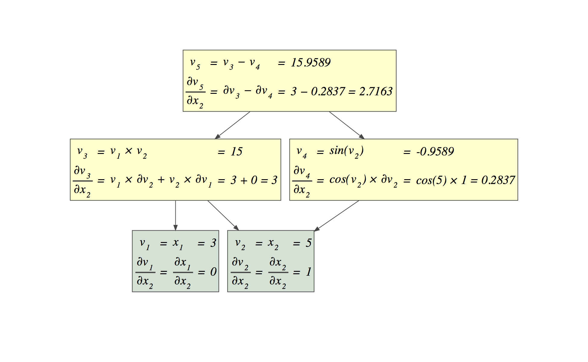
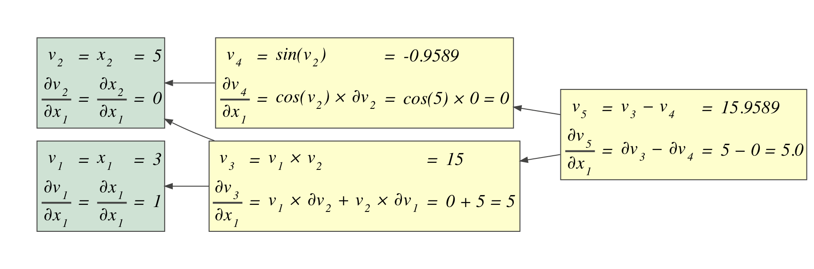
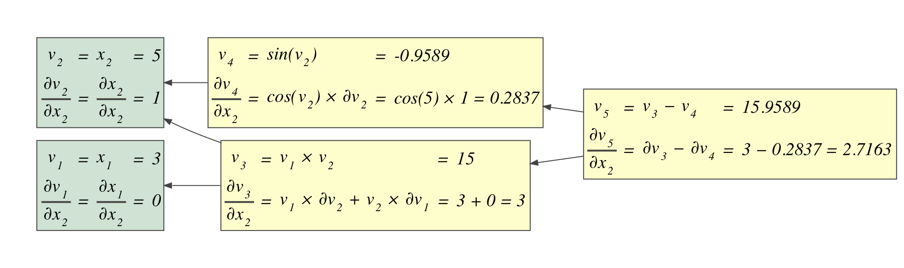
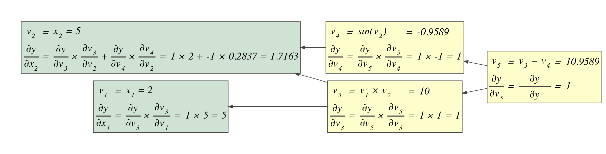

# auto-diff-edu

Simple automatic differentiation via operator overloading for educational purposes

Requires graphviz (`dot` executable) to be installed on your machine and also the python package installed with `pip install graphviz`. I had to do (on mac)

```bash
brew install graphviz --with-pango
```

to get the cairo support for subscripts in the graph visualizations.

For y = f(x1,x2) = ln(x1) + x1 * x2 - sin(x2):

**Forward**






**Backward**

